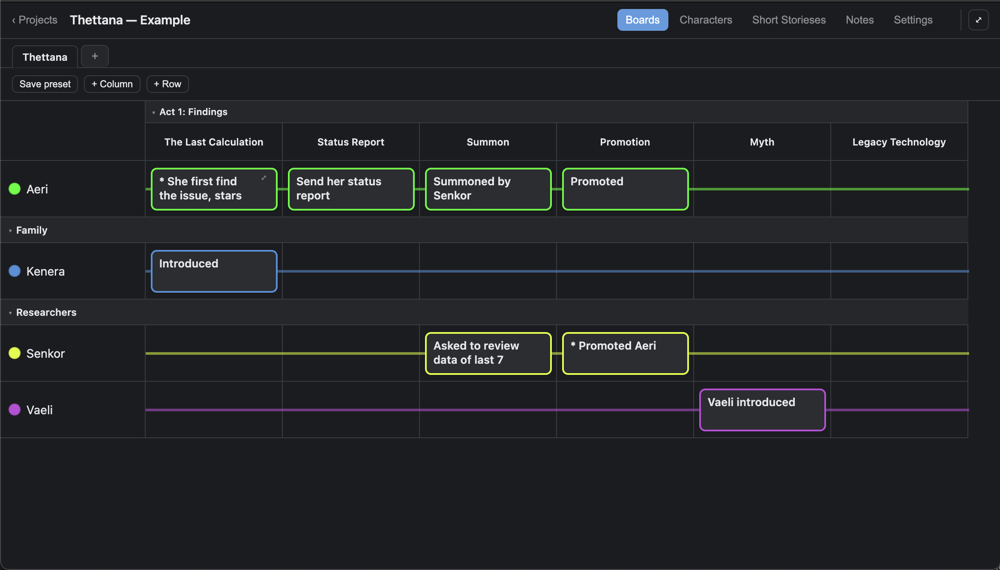
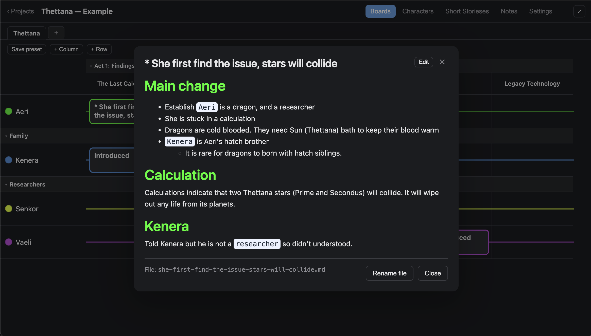
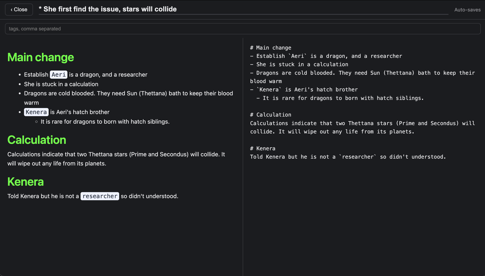
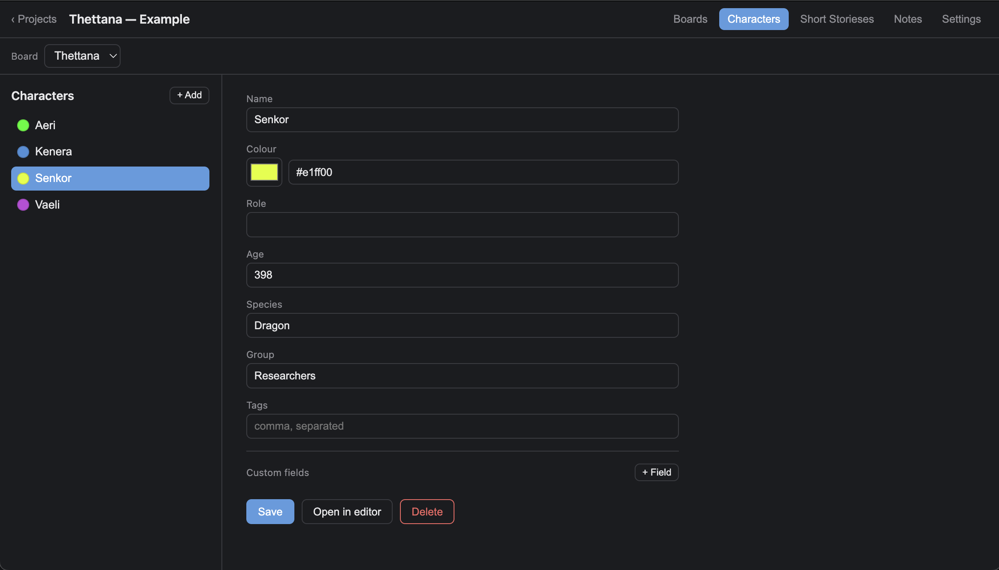
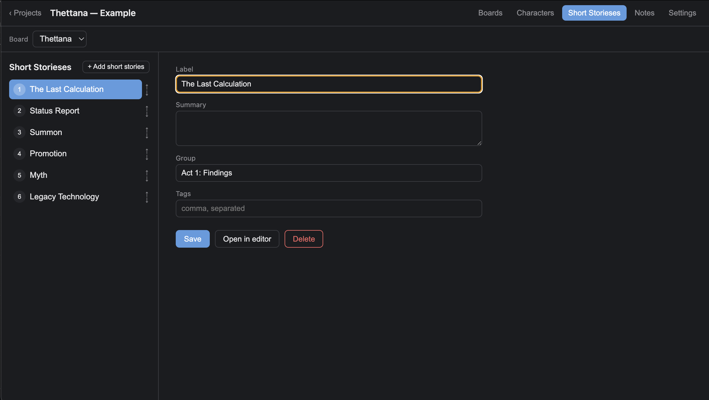
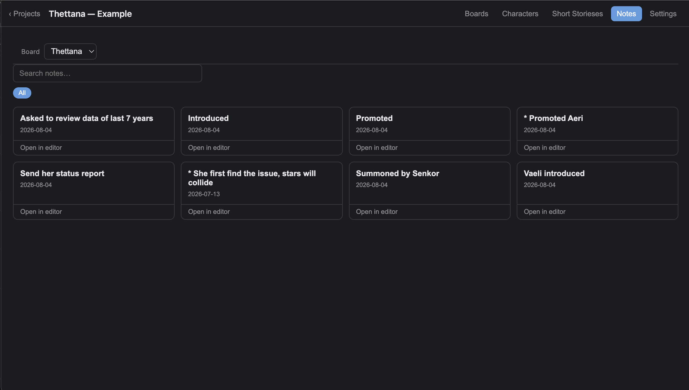
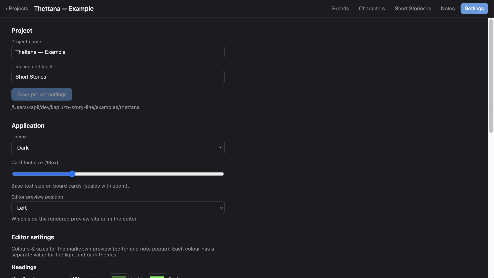
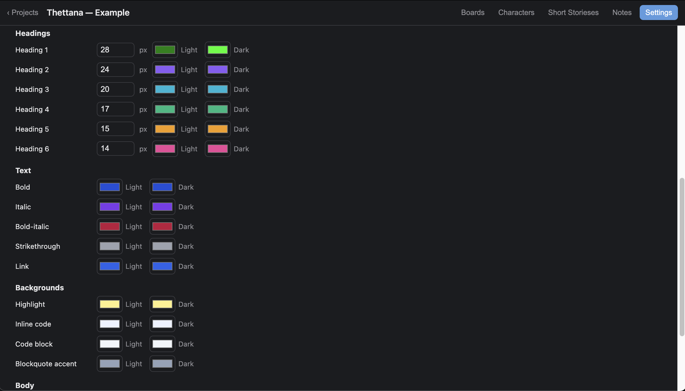

# ZN Story Line

A desktop app for **visual story planning**. The core interface is a structured 2D grid — **characters × timeline** — so you can see, at a glance, what happens to whom and when. It's filesystem-first: a project is just a folder of Markdown and JSON, with no database, so your writing stays portable and editable in any tool.

> Built as a personal tool. Not affiliated with any other story-planning software.

## Inspiration

ZN Story Line (short for **Zoey Nyxx Story Line**), named after the lead character of my in-progress novel series. It grew out of a few things:

- **J.K. Rowling's plot-grid method**: the hand-drawn spreadsheet approach to plotting a story.
- **My own Google Sheet** for planning the Zoey Nyxx series.
- **Plottr** — I really liked it and wanted to use it for the novel, but it's a paid tool. With a limited persnal budget, I has to be careful about where I invest. Since I'm a developer, learning to build Electron apps, and had Claude to help, I decided to build my own little version instead.

I made this tool for myself, but also publishing as open-source, in case helpful for anyone else.

## Features

- **Character × timeline boards** — place cards in a grid of characters (rows) and timeline units (columns); a card can span multiple columns.
- **Family tree** — draw a board's characters as a family tree on an infinite canvas, coloured by family. Save several trees over the same cast (his side, her side, the joined tree), arrange any of them by hand, and bend the connectors where they read badly.
- **Cast and plot are separate** — a character you add for context (a grandparent on the family tree, say) does not become a row on your board. Each board and each tree has its own list of who is on it, and the Characters tab filters by where each one appears.
- **Multiple independent boards** — each board owns its own characters, timeline and notes. Reorder boards by dragging their tabs.
- **Drag-and-drop everywhere** — reorder boards, timeline units and character rows; group rows/columns and collapse groups.
- **Dedicated Markdown editor** with a live, configurable preview — per-theme colours for headings, emphasis, code, highlights and more (separate light/dark palettes). A small toolbar covers headings, bold, italic, strikethrough and highlight, so you don't have to know the syntax. This editor is meant to write short notes, don't confuse it with writing tool replacement.
- **Images and attachments** — add a picture or PDF with the toolbar button, or just paste or drag one onto the editor. It's copied into the project folder and published with the static site.
- **Rename-safe notes** — notes carry a stable id, so renaming a file (in the app or an external editor) never breaks a card.
- **Live reload** — external edits (e.g. from another Markdown editor) are picked up automatically.
- **Light / dark themes.**
- **Publish to the web** — export a project as a self-contained, read-only static site you can upload anywhere (see [`docs/publishing.md`](./docs/publishing.md)).

## Help

The user manual lives in [`examples/sl-docs`](./examples/sl-docs) — and is itself
a ZN Story Line project. Open it in the app (**Open project** → pick that folder)
and you get four boards covering every feature: *Start here*, *Feature
reference*, *How do I…?* and *Your files on disk*.

Developer-facing docs stay here in the repo: [`docs/publishing.md`](./docs/publishing.md)
for the static export, [`docs/workflow.md`](./docs/workflow.md) for build and
release, and [`docs/llmwiki/`](./docs/llmwiki) for AI agents.

## Screenshots

**Board**



**Card on board**



**Editor**



**Characters**



**Chapters**



**Notes**



**Settings 1**



**Settings 2**



## Tech stack

- **Electron + React + TypeScript**, bundled with [electron-vite](https://electron-vite.org/) (Vite).
- **Filesystem-first storage** — no database. A project is a folder:

  ```
  project/
    project.json                     # project metadata + schema version
    boards/<boardId>/
      board.json                     # card placement, order, presets, zoom
      characters/<id>.md             # one Markdown file per character
      timeline/<id>.md               # one Markdown file per timeline unit
      notes/<id>.md                  # note bodies (Markdown + frontmatter)
      views/<id>.json                # one saved family tree per file
  ```

- Frontmatter is round-tripped with `gray-matter`; the on-disk schema is versioned and migrates automatically (with a backup) when you open an older project.

## Getting started

```bash
npm install      # install dependencies
npm run dev      # launch the app in development
```

Want to see it with real data? Open the sample project in [`examples/thettana`](./examples/thettana) (**Open project** → pick that folder). See [`examples/`](./examples) for details, including how to try the Family tab.

## Scripts

| Command | Description |
| --- | --- |
| `npm run dev` | Run the app in development (hot reload). |
| `npm run build` | Type-check and build for production. |
| `npm run build:web` | Build the static web shell (no story data) into `out/web`. |
| `npm run export:static -- --project <dir> --out <dir>` | Export a project as an uploadable read-only site. See [publishing](./docs/publishing.md). |
| `npm run typecheck` | Type-check main + renderer. |
| `npm test` | Run unit + component tests (Vitest). |
| `npm run test:coverage` | Run tests with a coverage report (`coverage/`). |
| `npm run test:e2e` | Run end-to-end tests (Playwright). |

## Instructions for AI agents

If you are an AI coding agent (Claude, Copilot, or otherwise) working in this repo, **read [`docs/llmwiki/`](./docs/llmwiki/) before making changes** — start with [`docs/llmwiki/README.md`](./docs/llmwiki/README.md). It's the project's portable knowledge base for AI agents (architecture, data model, versioning/schema policy, issue workflow, and environment gotchas), so context carries across machines and accounts. The most important rule: **never run `git` commit/push — hand off changes for the maintainer to commit.**

## License

The application's source code is licensed under [MIT](./LICENSE) © Zoey Nyxx (Kapil Sharma).

The example story content under [`examples/`](./examples) is **not** MIT-licensed — it is © Kapil Sharma (pen name Zoey Nyxx), all rights reserved, included for demonstration only. See [`examples/README.md`](./examples/README.md).
